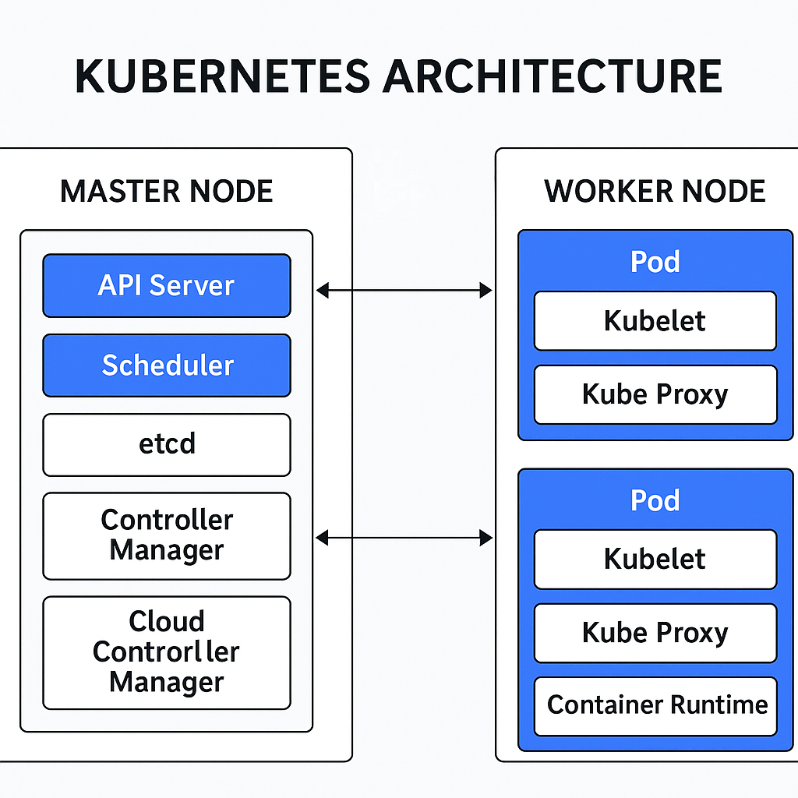

# Kubernetes Basics

This repository contains my notes, diagrams, and YAML files as I learn Kubernetes from the ground up.

## 🧠 Topics Covered
- Kubernetes Architecture
- Pod, Node, Cluster
- Master and Worker components
- YAML manifests (coming soon)

## 🧾 Notes
- Kubernetes Architecture: [kubernetes-architecture](Notes/Kubernetes-architecture.md)
- Kubernetes First app: [notes/kubernetes-firstapp.md](Notes/Kubernetes-firstapp.md)
- Kubernetes Deployment: [notes/kubernetes-deployment.md](Notes/Kubernetes-deployment.md)
- Kubernetes Services [notes/kubernetes-services.md](Notes/Kubernetes-services.md)
- 

## 📷 Diagram

